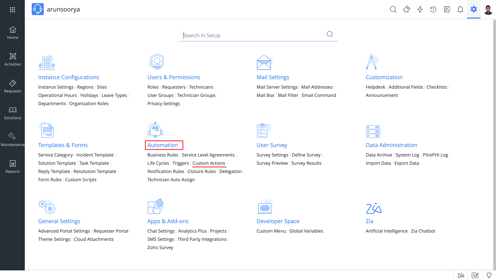
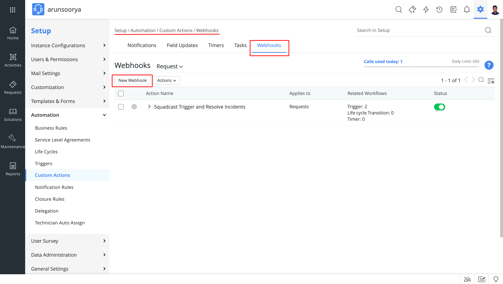
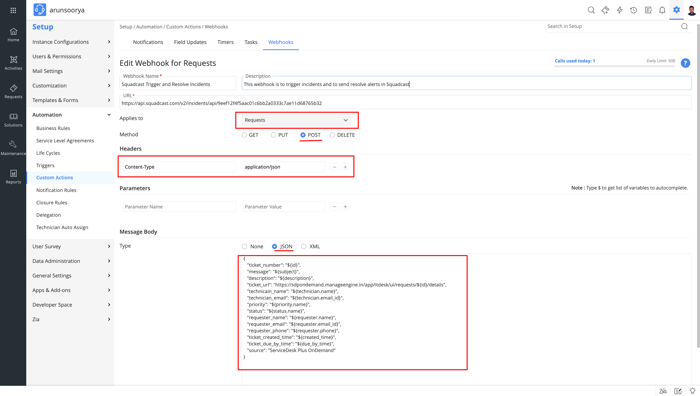
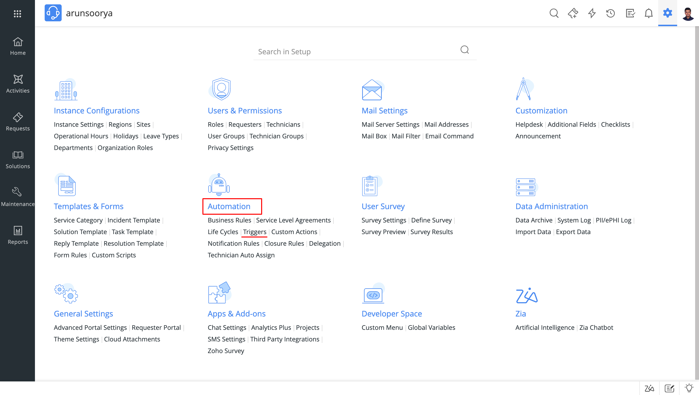
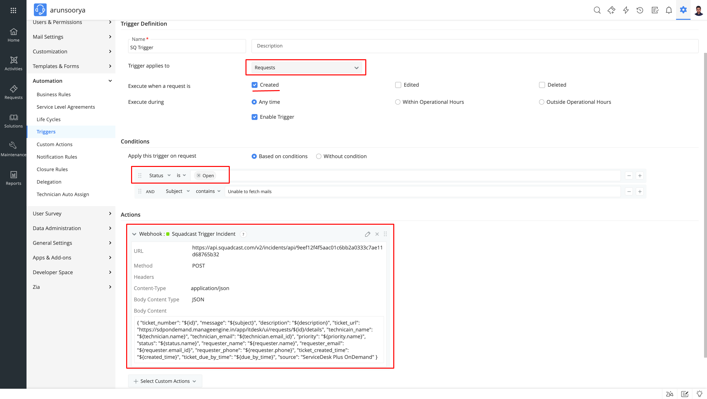
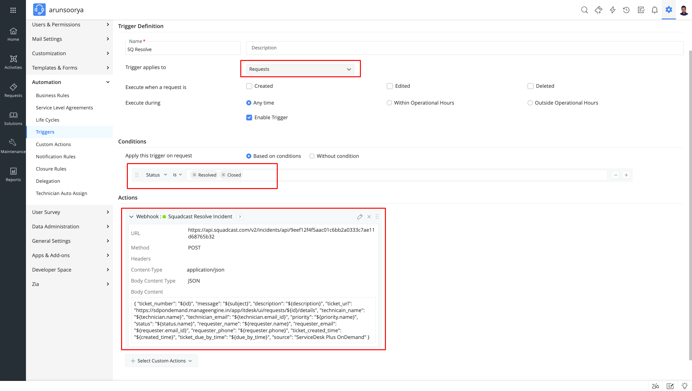

# ServiceDesk Plus On-Demand Integration

[<mark style="color:blue;">ServiceDesk Plus</mark>](https://www.manageengine.com/products/service-desk/) provides help desk agents and IT managers an integrated console to monitor and maintain the assets and IT requests generated from the users of the IT resources in an organization.

Route detailed ticket alerts from ServiceDesk Plus On-Demand to the right users in Squadcast.

### How to integrate ServiceDesk Plus On-Demand with Squadcast

#### In Squadcast: Using ServiceDesk Plus On-Demand as an Alert Source

1. Navigate to **Services** -> **Service Overview** -> select or search for your Service. Expand the accordion -> In the Alert Sources section, click **Add**.


2. Select **ServiceDesk Plus On-Demand**. Copy the displayed **Webhook URL** to [configure](readme.md#in-servicedesk-plus-on-demand-create-a-squadcast-webhook-alert) it within **ServiceDesk Plus On-Demand.** Finish by clicking **Add Alert Source** -> **Done**.



<mark style="color:orange;">**Important**</mark>**:**

When an alert source turns <mark style="color:green;">Active</mark>, it’ll show up under Configured Alert Sources. You can either generate a test alert from the integration or wait for a real-time alert to be generated by the Alert Source. 

An Alert Source is <mark style="color:green;">active</mark> if there is a recorded incident via that Alert Source for the Service.


#### In ServiceDesk Plus On-Demand: Create a Squadcast webhook alert

**(1)** In the app, go to **Automations > Custom Action > Webhooks** to create the webhook



**(2)** Click on **New Webhook**



**(3)** Fill in the form as shown below:

* **Applies to**: `Requests`
* **Method**: `POST`
* **Headers**: `Content-Type = 'application/json'`
* Choose **Message Body** as `Type=JSON` and Copy-paste the following JSON in the text box

```json
{
   "ticket_number": "${id}",
   "message": "${subject}",
   "description": "${description}",
   "ticket_url": "https://sdpondemand.manageengine.in/app/itdesk/ui/requests/${id}/details",
   "technicain_name": "${technician.name}",
   "technician_email": "${technician.email_id}",
   "priority": "${priority.name}",
   "status": "${status.name}",
   "requester_name": "${requester.name}",
   "requester_email": "${requester.email_id}",
   "requester_phone": "${requester.phone}",
   "ticket_created_time": "${created_time}",
   "ticket_due_by_time": "${due_by_time}",
   "source": "ServiceDesk Plus OnDemand"
}
```




To enable automatic incident creation in Squadcast when tickets are generated in SDP, follow these steps:

* Navigate to **Automations > Triggers**.
* Configure a `Trigger`, as illustrated in the screenshot below. You can include extra conditions as needed.






**(4)** Similarly, create an another `Trigger` as given in the below screenshot to send **resolve alert** to Squadcast:





Find more details on Trigger creation [here](https://help.sdpondemand.com/triggers)


That is it, you are now good to go! Whenever a ticket is `created`, an incident will be created in Squadcast. When the ticket is either `resolved` or `closed` in ServiceDesk Plus On-Demand, the corresponding incident will automatically get resolved in Squadcast as well.


**Note:**

Please ensure you are not sending the **<** character or any **HTML Tag** within the ticket description that would come in the **Description** ticket variable. This will cause the content of the description to break and the entire information will not be displayed.

